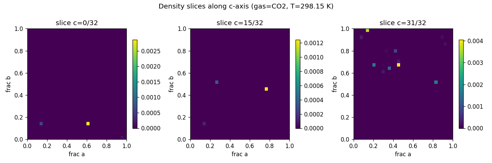
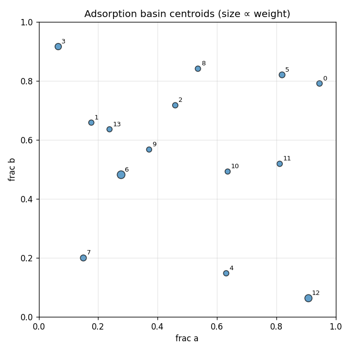

# widom-atlas report — C72H18Mg18O54

## Structure & Conditions

- **structure_id:** C72H18Mg18O54
- **gas:** CO2
- **temperature_K:** 298.15
- **cell_matrix (Å):**
  - [26.136, 0.0, 0.0]
  - [-13.067999999999994, 22.63443995331009, 0.0]
  - [0.0, 0.0, 6.942]

## Sample Summary

- **n_samples:** 1024
- **input_hash:** `9556a02e4b2b1d5e6a918eb1262d062d58a588dd39b1aae29db4b362a847432b`
- **mean_energy_eV:** 10214730478318.38

## Density Map

- **grid shape:** [32, 32, 32]
- **spacing_A:** [0.81675, 0.81675, 0.2169375]
- **smoothing_sigma_A:** 0.0

## Basins

| basin_id | count | weight | mean_energy_eV | spread_A | accessible_fraction |
|---|---|---|---|---|---|
| 0 | 4 | 0.0387 | -0.2121 | 0.0292 | 1.000 |
| 1 | 14 | 0.0160 | -0.1445 | 1.3338 | 1.000 |
| 2 | 7 | 0.0248 | -0.1775 | 1.2614 | 1.000 |
| 3 | 15 | 0.1150 | -0.2111 | 1.4002 | 1.000 |
| 4 | 17 | 0.0234 | -0.1599 | 1.3274 | 1.000 |
| 5 | 17 | 0.0672 | -0.2174 | 0.6272 | 1.000 |
| 6 | 27 | 0.2648 | -0.2269 | 1.9086 | 1.000 |
| 7 | 29 | 0.0840 | -0.2180 | 0.9632 | 1.000 |
| 8 | 5 | 0.0253 | -0.1898 | 0.3791 | 1.000 |
| 9 | 7 | 0.0093 | -0.1615 | 0.2437 | 1.000 |
| 10 | 9 | 0.0098 | -0.1790 | 0.1144 | 1.000 |
| 11 | 6 | 0.0237 | -0.1926 | 0.5749 | 1.000 |
| 12 | 23 | 0.1984 | -0.2395 | 0.3973 | 1.000 |
| 13 | 1 | 0.0113 | -0.1846 | 0.0000 | 1.000 |

## Symmetry Grouping
- **group 0** — space group `R-3` (#148), confidence 0.20, members: [0]
  - uncertainty: low_symmetry_host
- **group 1** — space group `R-3` (#148), confidence 0.20, members: [1]
  - uncertainty: low_symmetry_host
- **group 2** — space group `R-3` (#148), confidence 0.20, members: [2]
  - uncertainty: low_symmetry_host
- **group 3** — space group `R-3` (#148), confidence 0.20, members: [3]
  - uncertainty: low_symmetry_host
- **group 4** — space group `R-3` (#148), confidence 0.20, members: [4]
  - uncertainty: low_symmetry_host
- **group 5** — space group `R-3` (#148), confidence 0.20, members: [5]
  - uncertainty: low_symmetry_host
- **group 6** — space group `R-3` (#148), confidence 0.20, members: [6]
  - uncertainty: low_symmetry_host
- **group 7** — space group `R-3` (#148), confidence 0.20, members: [7]
  - uncertainty: low_symmetry_host
- **group 8** — space group `R-3` (#148), confidence 0.20, members: [8]
  - uncertainty: low_symmetry_host
- **group 9** — space group `R-3` (#148), confidence 0.20, members: [9]
  - uncertainty: low_symmetry_host
- **group 10** — space group `R-3` (#148), confidence 0.20, members: [10]
  - uncertainty: low_symmetry_host
- **group 11** — space group `R-3` (#148), confidence 0.20, members: [11]
  - uncertainty: low_symmetry_host
- **group 12** — space group `R-3` (#148), confidence 0.20, members: [12]
  - uncertainty: low_symmetry_host
- **group 13** — space group `R-3` (#148), confidence 0.20, members: [13]
  - uncertainty: low_symmetry_host

## Perturbations
_No perturbations applied to this run._

## Robustness
_No robustness comparison run._

## Caveats & Uncertainty
- Toy / synthetic insertion samples are not chemically meaningful by themselves.
- Symmetry assignments are uncertain on defective or strained frameworks.
