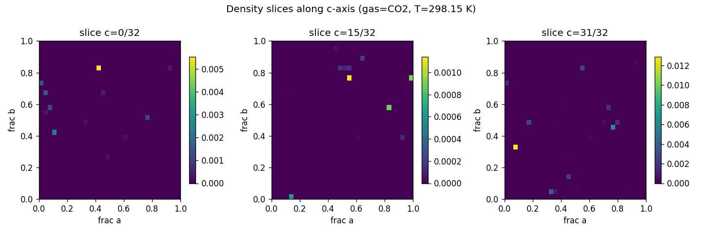
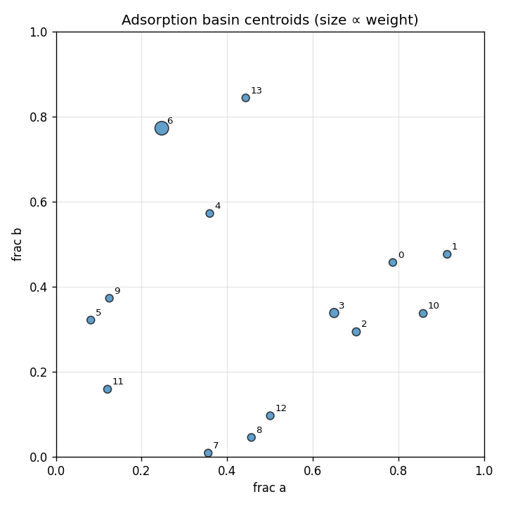

# widom-atlas report — C288H96Cu48O192

## Structure & Conditions

- **structure_id:** C288H96Cu48O192
- **gas:** CO2
- **temperature_K:** 298.15
- **cell_matrix (Å):**
  - [26.343, 0.0, 0.0]
  - [0.0, 26.343, 0.0]
  - [0.0, 0.0, 26.343]

## Sample Summary

- **n_samples:** 1024
- **input_hash:** `3aaf732faff4f48985b221ab420e2af2d433e62206fbeec06ce5fc1a190d5095`
- **mean_energy_eV:** 809718538667.7068

## Density Map

- **grid shape:** [32, 32, 32]
- **spacing_A:** [0.82321875, 0.82321875, 0.82321875]
- **smoothing_sigma_A:** 0.0

## Basins

| basin_id | count | weight | mean_energy_eV | spread_A | accessible_fraction |
|---|---|---|---|---|---|
| 0 | 3 | 0.0081 | -0.1408 | 0.5690 | 1.000 |
| 1 | 1 | 0.0121 | -0.1645 | 0.0000 | 1.000 |
| 2 | 1 | 0.0337 | -0.1908 | 0.0000 | 1.000 |
| 3 | 3 | 0.1043 | -0.2198 | 0.0000 | 1.000 |
| 4 | 3 | 0.0090 | -0.1332 | 0.5038 | 1.000 |
| 5 | 3 | 0.0129 | -0.1661 | 0.0000 | 1.000 |
| 6 | 1 | 0.4811 | -0.2591 | 0.0000 | 1.000 |
| 7 | 3 | 0.0116 | -0.1369 | 0.5381 | 1.000 |
| 8 | 1 | 0.0123 | -0.1649 | 0.0000 | 1.000 |
| 9 | 1 | 0.0078 | -0.1532 | 0.0000 | 1.000 |
| 10 | 1 | 0.0210 | -0.1786 | 0.0000 | 1.000 |
| 11 | 1 | 0.0189 | -0.1759 | 0.0000 | 1.000 |
| 12 | 1 | 0.0131 | -0.1665 | 0.0000 | 1.000 |
| 13 | 4 | 0.0094 | -0.1384 | 0.7769 | 1.000 |

## Symmetry Grouping
- **group 0** — space group `Fm-3m` (#225), confidence 0.13, members: [0]
  - uncertainty: low_symmetry_host
- **group 1** — space group `Fm-3m` (#225), confidence 0.13, members: [1]
  - uncertainty: low_symmetry_host
- **group 2** — space group `Fm-3m` (#225), confidence 0.13, members: [2]
  - uncertainty: low_symmetry_host
- **group 3** — space group `Fm-3m` (#225), confidence 0.13, members: [3]
  - uncertainty: low_symmetry_host
- **group 4** — space group `Fm-3m` (#225), confidence 0.13, members: [4, 7]
  - uncertainty: low_symmetry_host
- **group 5** — space group `Fm-3m` (#225), confidence 0.13, members: [5]
  - uncertainty: low_symmetry_host
- **group 6** — space group `Fm-3m` (#225), confidence 0.13, members: [6]
  - uncertainty: low_symmetry_host
- **group 7** — space group `Fm-3m` (#225), confidence 0.13, members: [8]
  - uncertainty: low_symmetry_host
- **group 8** — space group `Fm-3m` (#225), confidence 0.13, members: [9]
  - uncertainty: low_symmetry_host
- **group 9** — space group `Fm-3m` (#225), confidence 0.13, members: [10]
  - uncertainty: low_symmetry_host
- **group 10** — space group `Fm-3m` (#225), confidence 0.13, members: [11]
  - uncertainty: low_symmetry_host
- **group 11** — space group `Fm-3m` (#225), confidence 0.13, members: [12]
  - uncertainty: low_symmetry_host
- **group 12** — space group `Fm-3m` (#225), confidence 0.13, members: [13]
  - uncertainty: low_symmetry_host

## Perturbations
_No perturbations applied to this run._

## Robustness
_No robustness comparison run._

## Caveats & Uncertainty
- Toy / synthetic insertion samples are not chemically meaningful by themselves.
- Symmetry assignments are uncertain on defective or strained frameworks.
