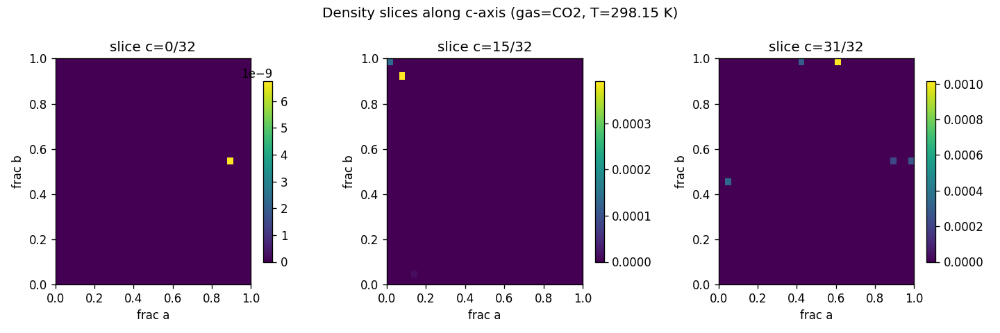
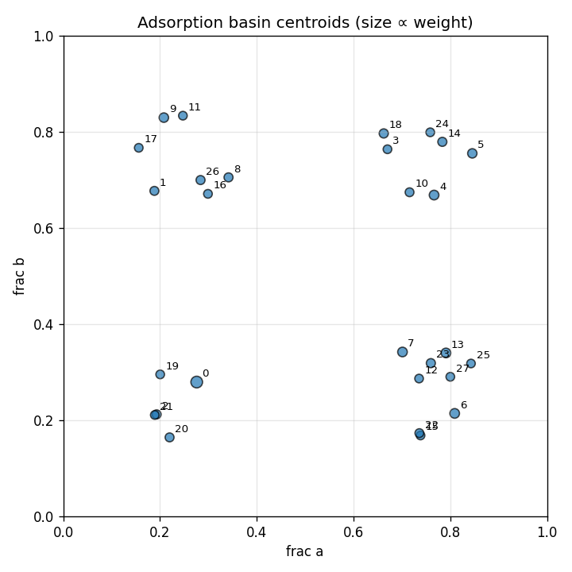

# widom-atlas report — C192H96O120Zr24

## Structure & Conditions

- **structure_id:** C192H96O120Zr24
- **gas:** CO2
- **temperature_K:** 298.15
- **cell_matrix (Å):**
  - [20.7004, 0.0, 0.0]
  - [0.0, 20.7004, 0.0]
  - [0.0, 0.0, 20.7004]

## Sample Summary

- **n_samples:** 1024
- **input_hash:** `af8bfc9ba1a1ef4b0a71ee9a7eed434fb659a7bf0f2befd078c49fd663ad0235`
- **mean_energy_eV:** 80029327058436.08

## Density Map

- **grid shape:** [32, 32, 32]
- **spacing_A:** [0.6468875, 0.6468875, 0.6468875]
- **smoothing_sigma_A:** 0.0

## Basins

| basin_id | count | weight | mean_energy_eV | spread_A | accessible_fraction |
|---|---|---|---|---|---|
| 0 | 9 | 0.1870 | -0.2293 | 1.4009 | 1.000 |
| 1 | 2 | 0.0236 | -0.2125 | 0.1942 | 1.000 |
| 2 | 9 | 0.0295 | -0.2212 | 0.0196 | 1.000 |
| 3 | 5 | 0.0122 | -0.1984 | 0.0007 | 1.000 |
| 4 | 4 | 0.0638 | -0.2410 | 0.0000 | 1.000 |
| 5 | 5 | 0.0477 | -0.2335 | 0.0076 | 1.000 |
| 6 | 4 | 0.0645 | -0.2157 | 0.9599 | 1.000 |
| 7 | 3 | 0.0616 | -0.2394 | 0.0455 | 1.000 |
| 8 | 5 | 0.0291 | -0.2209 | 0.0001 | 1.000 |
| 9 | 5 | 0.0536 | -0.2199 | 0.5885 | 1.000 |
| 10 | 2 | 0.0196 | -0.2107 | 0.0000 | 1.000 |
| 11 | 3 | 0.0118 | -0.1844 | 0.2904 | 1.000 |
| 12 | 2 | 0.0103 | -0.1940 | 0.0156 | 1.000 |
| 13 | 1 | 0.0645 | -0.2413 | 0.0000 | 1.000 |
| 14 | 7 | 0.0320 | -0.1839 | 1.0417 | 1.000 |
| 15 | 4 | 0.0102 | -0.1939 | 0.0205 | 1.000 |
| 16 | 8 | 0.0139 | -0.1925 | 0.3707 | 1.000 |
| 17 | 2 | 0.0106 | -0.1948 | 0.0000 | 1.000 |
| 18 | 2 | 0.0378 | -0.2223 | 0.3310 | 1.000 |
| 19 | 1 | 0.0119 | -0.1979 | 0.0000 | 1.000 |
| 20 | 2 | 0.0252 | -0.2171 | 0.0000 | 1.000 |
| 21 | 1 | 0.0086 | -0.1894 | 0.0000 | 1.000 |
| 22 | 5 | 0.0186 | -0.2073 | 0.2262 | 1.000 |
| 23 | 1 | 0.0328 | -0.2239 | 0.0000 | 1.000 |
| 24 | 1 | 0.0122 | -0.1984 | 0.0000 | 1.000 |
| 25 | 6 | 0.0081 | -0.1873 | 0.0161 | 1.000 |
| 26 | 1 | 0.0291 | -0.2209 | 0.0000 | 1.000 |
| 27 | 1 | 0.0130 | -0.2000 | 0.0000 | 1.000 |

## Symmetry Grouping
- **group 0** — space group `P1` (#1), confidence 0.45, members: [0]
  - uncertainty: low_symmetry_host
- **group 1** — space group `P1` (#1), confidence 0.45, members: [1]
  - uncertainty: low_symmetry_host
- **group 2** — space group `P1` (#1), confidence 0.45, members: [2]
  - uncertainty: low_symmetry_host
- **group 3** — space group `P1` (#1), confidence 0.45, members: [3]
  - uncertainty: low_symmetry_host
- **group 4** — space group `P1` (#1), confidence 0.45, members: [4]
  - uncertainty: low_symmetry_host
- **group 5** — space group `P1` (#1), confidence 0.45, members: [5]
  - uncertainty: low_symmetry_host
- **group 6** — space group `P1` (#1), confidence 0.45, members: [6]
  - uncertainty: low_symmetry_host
- **group 7** — space group `P1` (#1), confidence 0.45, members: [7]
  - uncertainty: low_symmetry_host
- **group 8** — space group `P1` (#1), confidence 0.45, members: [8]
  - uncertainty: low_symmetry_host
- **group 9** — space group `P1` (#1), confidence 0.45, members: [9]
  - uncertainty: low_symmetry_host
- **group 10** — space group `P1` (#1), confidence 0.45, members: [10]
  - uncertainty: low_symmetry_host
- **group 11** — space group `P1` (#1), confidence 0.45, members: [11]
  - uncertainty: low_symmetry_host
- **group 12** — space group `P1` (#1), confidence 0.45, members: [12]
  - uncertainty: low_symmetry_host
- **group 13** — space group `P1` (#1), confidence 0.45, members: [13]
  - uncertainty: low_symmetry_host
- **group 14** — space group `P1` (#1), confidence 0.45, members: [14]
  - uncertainty: low_symmetry_host
- **group 15** — space group `P1` (#1), confidence 0.45, members: [15]
  - uncertainty: low_symmetry_host
- **group 16** — space group `P1` (#1), confidence 0.45, members: [16]
  - uncertainty: low_symmetry_host
- **group 17** — space group `P1` (#1), confidence 0.45, members: [17]
  - uncertainty: low_symmetry_host
- **group 18** — space group `P1` (#1), confidence 0.45, members: [18]
  - uncertainty: low_symmetry_host
- **group 19** — space group `P1` (#1), confidence 0.45, members: [19]
  - uncertainty: low_symmetry_host
- **group 20** — space group `P1` (#1), confidence 0.45, members: [20]
  - uncertainty: low_symmetry_host
- **group 21** — space group `P1` (#1), confidence 0.45, members: [21]
  - uncertainty: low_symmetry_host
- **group 22** — space group `P1` (#1), confidence 0.45, members: [22]
  - uncertainty: low_symmetry_host
- **group 23** — space group `P1` (#1), confidence 0.45, members: [23]
  - uncertainty: low_symmetry_host
- **group 24** — space group `P1` (#1), confidence 0.45, members: [24]
  - uncertainty: low_symmetry_host
- **group 25** — space group `P1` (#1), confidence 0.45, members: [25]
  - uncertainty: low_symmetry_host
- **group 26** — space group `P1` (#1), confidence 0.45, members: [26]
  - uncertainty: low_symmetry_host
- **group 27** — space group `P1` (#1), confidence 0.45, members: [27]
  - uncertainty: low_symmetry_host

## Perturbations
_No perturbations applied to this run._

## Robustness
_No robustness comparison run._

## Caveats & Uncertainty
- Toy / synthetic insertion samples are not chemically meaningful by themselves.
- Symmetry assignments are uncertain on defective or strained frameworks.
