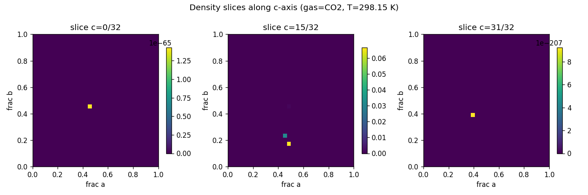
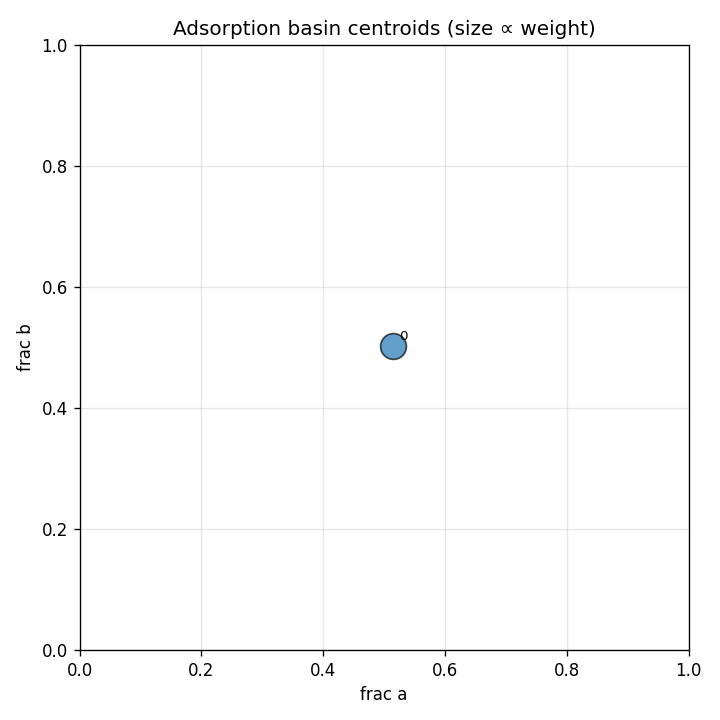

# widom-atlas report — O24Si12

## Structure & Conditions

- **structure_id:** O24Si12
- **gas:** CO2
- **temperature_K:** 298.15
- **cell_matrix (Å):**
  - [9.459, 0.0, 0.0]
  - [-0.6713541877329091, 9.435145179307707, 0.0]
  - [-0.6713541877329091, -0.7208215218635481, 9.407570403044124]

## Sample Summary

- **n_samples:** 1024
- **input_hash:** `7cb2d1e57e58a008d22cb68fa295a601905ed3db7f009e15ff61343fb5248662`
- **mean_energy_eV:** 3.728743678425323e+17

## Density Map

- **grid shape:** [32, 32, 32]
- **spacing_A:** [0.29559375, 0.29559375, 0.29559375]
- **smoothing_sigma_A:** 0.0

## Basins

| basin_id | count | weight | mean_energy_eV | spread_A | accessible_fraction |
|---|---|---|---|---|---|
| 0 | 543 | 1.0000 | -0.2960 | 2.9270 | 1.000 |

## Symmetry Grouping
- **group 0** — space group `R-3m` (#166), confidence 0.70, members: [0]

## Perturbations
_No perturbations applied to this run._

## Robustness
_No robustness comparison run._

## Caveats & Uncertainty
- Toy / synthetic insertion samples are not chemically meaningful by themselves.
- Symmetry assignments are uncertain on defective or strained frameworks.
