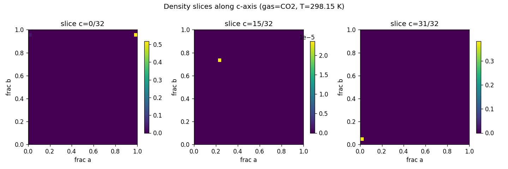
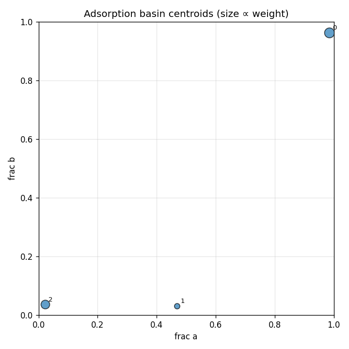

# widom-atlas report — O384Si192

## Structure & Conditions

- **structure_id:** O384Si192
- **gas:** CO2
- **temperature_K:** 298.15
- **cell_matrix (Å):**
  - [24.555, 0.0, 0.0]
  - [0.0, 24.555, 0.0]
  - [0.0, 0.0, 24.555]

## Sample Summary

- **n_samples:** 1024
- **input_hash:** `dd8af7515ab7e66629c6301a957bd502e3cdbd7b1ccef883101c01301dec1317`
- **mean_energy_eV:** 26397340994708.78

## Density Map

- **grid shape:** [32, 32, 32]
- **spacing_A:** [0.76734375, 0.76734375, 0.76734375]
- **smoothing_sigma_A:** 0.0

## Basins

| basin_id | count | weight | mean_energy_eV | spread_A | accessible_fraction |
|---|---|---|---|---|---|
| 0 | 5 | 0.5506 | -0.3959 | 0.2017 | 1.000 |
| 1 | 2 | 0.0269 | -0.3241 | 0.0000 | 1.000 |
| 2 | 1 | 0.3819 | -0.3923 | 0.0000 | 1.000 |

## Symmetry Grouping
- **group 0** — space group `Fm-3c` (#226), confidence 0.20, members: [0]
  - uncertainty: low_symmetry_host
- **group 1** — space group `Fm-3c` (#226), confidence 0.20, members: [1]
  - uncertainty: low_symmetry_host
- **group 2** — space group `Fm-3c` (#226), confidence 0.20, members: [2]
  - uncertainty: low_symmetry_host

## Perturbations
_No perturbations applied to this run._

## Robustness
_No robustness comparison run._

## Caveats & Uncertainty
- Toy / synthetic insertion samples are not chemically meaningful by themselves.
- Symmetry assignments are uncertain on defective or strained frameworks.
