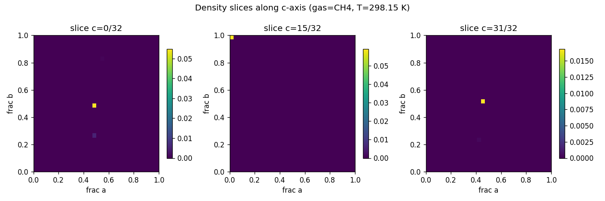
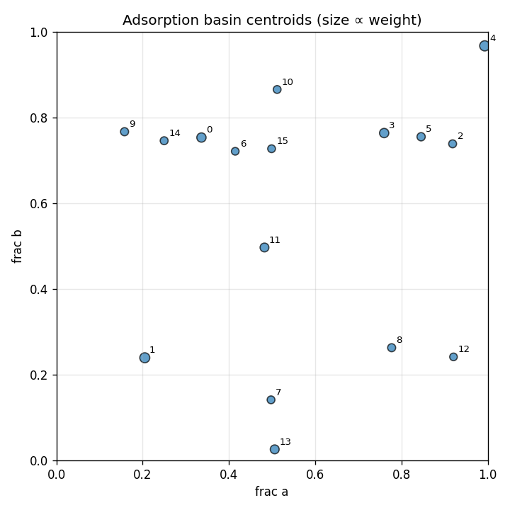

# widom-atlas report — O192Si96

## Structure & Conditions

- **structure_id:** O192Si96
- **gas:** CH4
- **temperature_K:** 298.15
- **cell_matrix (Å):**
  - [20.022, 0.0, 0.0]
  - [0.0, 19.899, 0.0]
  - [0.0, 0.0, 13.383]

## Sample Summary

- **n_samples:** 1024
- **input_hash:** `a7c00e4ef29e98809c29358c7334e380363ad067a2de3cfb47972c1caacef16d`
- **mean_energy_eV:** 28002106167.38622

## Density Map

- **grid shape:** [32, 32, 32]
- **spacing_A:** [0.6256875, 0.62184375, 0.41821875]
- **smoothing_sigma_A:** 0.0

## Basins

| basin_id | count | weight | mean_energy_eV | spread_A | accessible_fraction |
|---|---|---|---|---|---|
| 0 | 7 | 0.1094 | -0.3214 | 0.4222 | 1.000 |
| 1 | 16 | 0.1597 | -0.3254 | 0.5842 | 1.000 |
| 2 | 6 | 0.0250 | -0.2998 | 0.0595 | 1.000 |
| 3 | 11 | 0.1105 | -0.3183 | 0.7284 | 1.000 |
| 4 | 11 | 0.1732 | -0.3339 | 0.7046 | 1.000 |
| 5 | 7 | 0.0450 | -0.3161 | 0.0007 | 1.000 |
| 6 | 6 | 0.0094 | -0.2714 | 0.2000 | 1.000 |
| 7 | 4 | 0.0174 | -0.2760 | 0.6792 | 1.000 |
| 8 | 1 | 0.0320 | -0.3073 | 0.0000 | 1.000 |
| 9 | 14 | 0.0358 | -0.2940 | 0.4291 | 1.000 |
| 10 | 10 | 0.0181 | -0.2693 | 0.7356 | 1.000 |
| 11 | 3 | 0.0796 | -0.3097 | 0.5770 | 1.000 |
| 12 | 5 | 0.0084 | -0.2354 | 0.7248 | 1.000 |
| 13 | 4 | 0.0840 | -0.3313 | 0.0540 | 1.000 |
| 14 | 1 | 0.0254 | -0.3014 | 0.0000 | 1.000 |
| 15 | 2 | 0.0159 | -0.2894 | 0.0000 | 1.000 |

## Symmetry Grouping
- **group 0** — space group `Pnma` (#62), confidence 0.63, members: [0]
- **group 1** — space group `Pnma` (#62), confidence 0.63, members: [1]
- **group 2** — space group `Pnma` (#62), confidence 0.63, members: [2]
- **group 3** — space group `Pnma` (#62), confidence 0.63, members: [3]
- **group 4** — space group `Pnma` (#62), confidence 0.63, members: [4, 13]
- **group 5** — space group `Pnma` (#62), confidence 0.63, members: [5]
- **group 6** — space group `Pnma` (#62), confidence 0.63, members: [6]
- **group 7** — space group `Pnma` (#62), confidence 0.63, members: [7, 10]
- **group 8** — space group `Pnma` (#62), confidence 0.63, members: [8]
- **group 9** — space group `Pnma` (#62), confidence 0.63, members: [9]
- **group 10** — space group `Pnma` (#62), confidence 0.63, members: [11]
- **group 11** — space group `Pnma` (#62), confidence 0.63, members: [12]
- **group 12** — space group `Pnma` (#62), confidence 0.63, members: [14]
- **group 13** — space group `Pnma` (#62), confidence 0.63, members: [15]

## Perturbations
_No perturbations applied to this run._

## Robustness
_No robustness comparison run._

## Caveats & Uncertainty
- Toy / synthetic insertion samples are not chemically meaningful by themselves.
- Symmetry assignments are uncertain on defective or strained frameworks.
